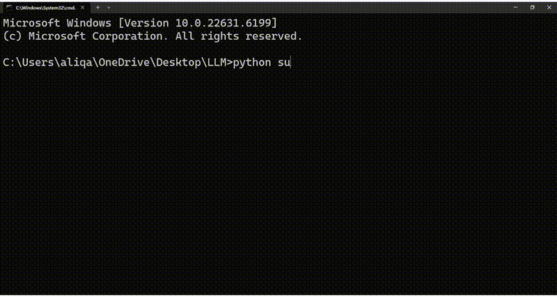

# Local AI Video Summarization Pipeline

An offline pipeline that transcribes and summarizes long-form video content
using **faster-whisper** (speech-to-text + translation) and **Ollama**
(local LLM summarization) — no cloud APIs, no per-request cost, runs
entirely on consumer hardware (tested on a laptop with an Nvidia MX450,
2GB VRAM).

Given a video file, it:
1. Transcribes the audio and translates it directly to English (even when
   the source audio is in Urdu)
2. Splits the transcript into time-based chunks
3. Summarizes each chunk with a local LLM, under a strict prompt that
   forbids inventing information
4. Synthesizes the per-chunk summaries into one coherent, timestamped
   final summary

## Demo



*The pipeline transcribing and summarizing an Urdu-language audio clip end to end, running fully offline. (Transcription is cached between runs, so this demo shows the summarization stage against a pre-cached transcript.)*

## Why this was harder than it looks

This started as a simple "wire Whisper to an LLM" script. Getting it to
produce *trustworthy* output on real-world audio — fast, idiomatic, poetic
Urdu religious oratory — surfaced four distinct problems, each requiring a
different fix:

**1. Corrupted transcription (gibberish output).**
The initial version used `openai-whisper` with default settings, which
silently enables fp16 inference on any CUDA device. The MX450 is old and
VRAM-limited enough that fp16 inference produced garbled, nonsensical
transcript segments. Fixed by forcing fp32 and disabling
`condition_on_previous_text` (which otherwise lets one bad segment corrupt
the ones that follow it).

**2. Weak transcription accuracy on hard audio.**
Even after fixing (1), the smaller Whisper model sizes (`tiny`/`base`)
weren't accurate enough for fast, accented religious oratory with
Arabic/Persian loanwords — proper nouns and poetry lines came out mangled.
Switched to **faster-whisper** (a CTranslate2-based reimplementation),
which runs a much larger model (`medium`) on **CPU with int8
quantization** instead of needing GPU VRAM — trading runtime speed for
real accuracy.

**3. Confident hallucination from the summarization model.**
With a working transcript, the summarizer (`llama3.2:1b`, a 1B-parameter
local model) began inventing entire unrelated narratives — at one point
generating a story about Jesus and the crucifixion that has no relation
to the actual (Islamic) source content. Root cause: Llama 3.2's small
models are trained almost entirely on English and have very weak
comprehension of Urdu, especially at 1B scale — so instead of reading the
text, the model was pattern-matching "this sounds religious" and
free-associating in English. Fixed by using Whisper's built-in
**speech-to-English translation** (`task="translate"`) so the summarizer
never has to understand Urdu at all — it only ever sees English.

**4. A CUDA crash when upgrading the summarization model.**
Moving to a larger, more capable summarizer (`llama3.1:8b`) caused
Ollama's server process to crash outright with a CUDA initialization
error — the MX450 doesn't have enough VRAM for this model, and Ollama
didn't fail gracefully. Fixed by setting `CUDA_VISIBLE_DEVICES=-1` to
force Ollama onto CPU-only inference.

## Known limitation

Iqbal's poetry (quoted throughout the source audio) frequently switches
into **classical Persian** mid-line, not Urdu. Since the pipeline forces
`language="ur"` for the whole video, Whisper occasionally mistranslates
these specific Persian couplets. This is a real, understood edge case —
not something further prompt tuning can fix — and would require
language-switching detection mid-transcript to solve properly.

## Tech stack

- [faster-whisper](https://github.com/SYSTRAN/faster-whisper) (CTranslate2) — transcription + translation, `medium` model, CPU/int8
- [Ollama](https://ollama.com) running `llama3.1:8b` — local summarization
- Python

## Setup

```bash
pip install -r requirements.txt

# Install ffmpeg (required for audio extraction)
winget install ffmpeg      # Windows
# or: brew install ffmpeg  # macOS

# Install Ollama from https://ollama.com, then pull the model:
ollama pull llama3.1:8b
```

If you're on an older/low-VRAM NVIDIA GPU and Ollama crashes with a CUDA
error, force CPU-only mode by setting the environment variable
`CUDA_VISIBLE_DEVICES=-1` before launching Ollama.

## Usage

```bash
python summarizer.py
```

Drop your video file in the same folder and update `local_video_file` at
the bottom of the script to match its name.

The first successful run caches the transcript to `transcript_cache.json`
— subsequent runs reuse it instantly instead of re-transcribing, which
matters since transcription alone can take several minutes on CPU.

## Example output

Running on a ~10-minute Urdu-language lecture:

```
📊 FINAL VIDEO SUMMARY

The speaker reflects on the state of Muslims in their own land versus
those who seek to migrate to Europe, highlighting the importance of
adhering to Islamic teachings.

* A Muslim man's martyrdom serves as an example of the risks and
  sacrifices involved in staying true to one's faith (03:04).
* Education under Islamic guidance is seen as a source of spiritual
  growth and strength, represented by bright eyes like those of a
  lion (06:07).
* Pursuing secular education is described as leading to disillusionment,
  referred to as becoming "a pile of dust" (06:07).
* A young man expresses desire for modern comforts, while highlighting
  the personal cost of the education he received (09:09).
```

## What I'd improve next

- Detect language switches mid-transcript (Urdu ↔ classical Persian) instead of forcing one language for the whole video
- Run on a machine with more VRAM to use GPU acceleration for the summarization step, cutting runtime significantly
- Experiment with a mid-size model (e.g. `llama3.2:3b`) to find a better speed/accuracy balance than the current 1B-vs-8B jump
