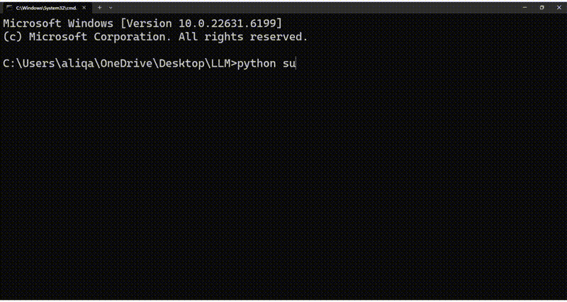

# Local AI Video Summarization Pipeline

An offline pipeline that transcribes long-form video and produces a
YouTube-style chaptered summary, using **faster-whisper** for speech-to-text
and **Ollama** for local LLM summarization. No cloud APIs, no per-request
cost, no audio leaving the machine.

Given a video or audio file, it:

1. Transcribes the audio with `large-v3`, verifying that every second of
   audio is accounted for
2. Detects genuine **topic boundaries** across the transcript, rather than
   slicing on a fixed clock interval
3. Summarizes each resulting chapter from that chapter's own transcript text
4. Consolidates the chapters, merging adjacent duplicates and writing an
   overview paragraph

## Demo



*The pipeline transcribing and summarizing an Urdu-language audio clip end to end, running fully offline.*

## Why this was harder than it looks

This started as a simple "wire Whisper to an LLM" script. Getting it to
produce *trustworthy* output on real-world audio, namely fast and idiomatic
Urdu religious oratory, surfaced a series of distinct problems, each needing
a different fix.

**1. Corrupted transcription (gibberish output).**
The initial version used `openai-whisper` with default settings, which
silently enables fp16 inference on any CUDA device. On an older, VRAM-limited
GPU this produced garbled transcript segments and eventually a hard crash:
`ValueError: Expected parameter logits ... but found invalid values: tensor([[nan, nan, ...]])`.
The fp16 path was producing NaN logits, which the sampler could not consume.
Fixed at the time by forcing fp32.

**2. Weak transcription accuracy on hard audio.**
Even with stable inference, the smaller Whisper sizes were not accurate enough
for accented oratory with Arabic and Persian loanwords. Proper nouns and
poetry lines came out mangled. Switched to **faster-whisper** (a CTranslate2
reimplementation), which fits a far larger model in the same budget through
quantized inference.

**3. Confident hallucination from the summarization model.**
With a working transcript, `llama3.2:1b` began inventing entire unrelated
narratives, at one point generating a story with no relation to the actual
source content. Root cause: 1B-scale Llama models are trained almost entirely
on English and have very weak Urdu comprehension, so instead of reading the
text the model was pattern-matching "this sounds religious" and
free-associating.

**4. Model selection driven by benchmark, not vendor claims.**
The fix for (3) was a stronger summarizer, but "multilingual" marketing copy
is not evidence. Checking UrduMMLU, an academic benchmark testing native Urdu
comprehension, showed that among open models small enough for a 6GB card,
Gemma-2-9B leads at roughly 55 to 57%, ahead of Qwen3-8B near 50%. The
counterintuitive part: Urdu-*specific* fine-tunes score below 36%, so
reaching for a niche "Urdu model" would have been a downgrade. The pipeline
uses `gemma2:9b` on that basis.

**5. Silently truncated transcripts.**
The most subtle failure. Voice Activity Detection is on by default and skips
"non-speech" audio, but Silero VAD misclassifies reverberant, quiet, or
music-backed speech. On a mosque recording it dropped a 28-second stretch and
cut the final 8 seconds entirely, and nothing in the output indicated
anything was missing. Loosening the VAD thresholds was not enough. VAD is now
off, and both of Whisper's segment-drop mechanisms (`no_speech_threshold`,
`log_prob_threshold`) are set to `None` rather than merely relaxed, because on
a lower-resource language the model's confidence is legitimately low and real
speech was being discarded as noise.

**6. Trusting completeness instead of verifying it.**
Rather than assert the transcript is complete, the pipeline measures it. After
transcription it reports coverage against the true decoded audio duration and
lists every gap over 3 seconds by timestamp, with the same gaps marked inline
in the transcript file as `<<< NO SPEECH DETECTED >>>`. You can jump to each
one and confirm for yourself whether it is real silence or a miss.

## Chaptering approach

Earlier versions cut the transcript into fixed time windows and summarized
each independently. That produces two visible artifacts: a topic gets split
across a boundary mid-thought, and the same topic gets re-titled slightly
differently in adjacent chunks because neither chunk knows the other exists.

The current pipeline runs three passes instead:

| Pass | What it does |
|---|---|
| 1 | Scans large windows and marks genuine topic changes, not every sentence |
| 2 | Summarizes each chapter using only that chapter's own transcript text |
| 3 | Merges adjacent near-duplicate chapters, tightens titles, writes the overview |

LLM-returned timestamps are snapped to the nearest real transcript segment, so
a slightly mangled timestamp cannot corrupt chapter slicing.

## Known limitations

Poetry quoted in the source audio frequently switches into **classical
Persian** mid-line. Since the pipeline sets one language for the whole file,
those couplets are occasionally mistranscribed. Solving it properly needs
language-switch detection mid-transcript.

A 9B model is a real ceiling, not a small one. Roughly 55 to 57% on a Urdu
comprehension benchmark means nuanced devotional content will still sometimes
be misread. That is a model-capability limit, not a prompting problem.

This is audio-only. Anything conveyed visually, such as slides or on-screen
text, is invisible to it.

## Tech stack

- [faster-whisper](https://github.com/SYSTRAN/faster-whisper) (CTranslate2), `large-v3`
- [Ollama](https://ollama.com) running `gemma2:9b`
- Python 3.12

Developed against an RTX 4050 Laptop GPU (6GB VRAM). `large-v3` at float16
occupies roughly 4.7GB, and Whisper's VRAM is released before Ollama loads,
so both fit in sequence on a 6GB card.

## Setup

```bash
pip install -r requirements.txt

# ffmpeg is required for audio decoding
winget install Gyan.FFmpeg   # Windows
# or: brew install ffmpeg    # macOS

# Install Ollama from https://ollama.com, then pull the model:
ollama pull gemma2:9b
```

No NVIDIA GPU is required. The script probes for a usable CUDA device at
startup and falls back to CPU with int8 automatically, which is considerably
slower but works.

Model weights cache to the standard Hugging Face location by default. To keep
them elsewhere, set `WHISPER_CACHE_DIR`:

```bash
export WHISPER_CACHE_DIR=/path/to/models        # bash
$env:WHISPER_CACHE_DIR = "D:\models\whisper"    # PowerShell
```

## Usage

```bash
python summarizer.py
```

Drop a video or audio file in the same folder and run it. The script picks up
the first media file it finds, including WhatsApp voice notes (`.opus`,
`.m4a`) alongside the usual video formats.

Set `VIDEO_LANGUAGE` near the top of the script to your source language, or to
`None` for auto-detection.

Two files are written next to the input: `<name>_transcript.txt` (raw, with
timestamps and any gap markers) and `<name>_summary.txt`. The transcript is
saved *before* summarization begins, so the expensive transcription survives
even if the LLM stage fails.

Transcription is also cached to `<name>_transcript_cache.json`. Since the LLM
stage fails for reasons unrelated to transcription (Ollama not running, model
not pulled), a retry reuses the cached transcript and costs seconds rather
than re-running the whole thing. The cache is fingerprinted against the media
file's size and mtime plus the model and language settings, so it invalidates
itself whenever any of those change. Delete the file to force a fresh
transcription.

## Example output

```
📊  Coverage: 99.4% of 8:13 (8:10 transcribed)
    No gaps over 3.0s. Transcript is continuous.

📹  Shaikh Mahmood Affandi
⏱   Duration: 8:13
────────────────────────────────────────────────────────────
📝  OVERVIEW

This video explores a spiritual journey, the importance of authentic
Islamic teachings, and the role of traditional healing practices.
Through personal anecdotes, the speaker traces a path toward a deeper
understanding of faith.

────────────────────────────────────────────────────────────
📌  KEY TOPICS & TIMESTAMPS
────────────────────────────────────────────────────────────

[0:00] The Journey of Life — Introduces life as a journey toward death,
       using a poetic verse to set the stage.
[1:37] Authenticity in Hadith — Describes the chain of transmission for a
       specific hadith and an encounter with a scholar in Turkey.
[2:40] Islamic Revival in Turkey — The life and influence of a scholar who
       kept religious teaching alive under restriction.
[7:31] Healing with Honey — A treatment involving honey and physical
       therapy.
```

## What I'd improve next

- Detect language switches mid-transcript (Urdu to classical Persian) instead of fixing one language per file
- Checkpoint between the three LLM passes, so a failure in pass 2 does not discard chaptering progress (transcription itself is already cached)
- Evaluate whether Whisper's `task="translate"` beats asking the summarizer to read Urdu directly, since translating at the transcription stage removes the LLM's comprehension ceiling from the critical path
- Batch mode for processing a folder of recordings unattended
